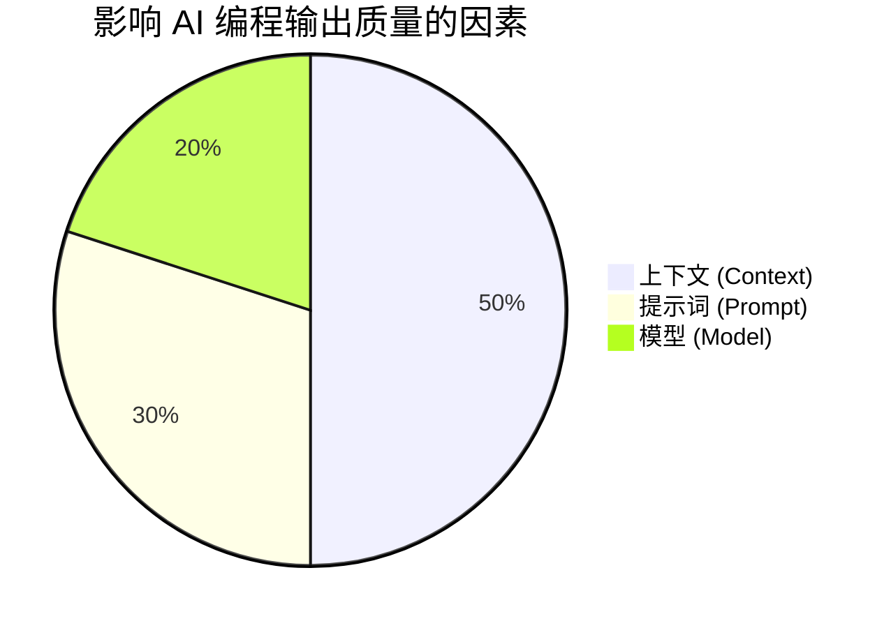

# Vibe Coding 实践分享

掌握上下文、提示词与模型的驾驭艺术

  
<b>分享人：</b> guoysh

  
<b>日期：</b> 5月15日

  
    开始探索 <carbon:arrow-right class="inline"/>
  

---
layout: default
---

# 什么是 Vibe Coding？

> **Vibe Coding** 是最近在 AI 编程圈流行的一个词，意为“凭直觉/感觉写代码”。

核心理念：
- **人类负责“想”**：专注于系统架构、业务逻辑和用户体验。
- **AI 负责“写”**：处理语法、样板代码和具体的实现细节。
- **交互方式**：通过自然语言与 AI 进行高频对话，像“结对编程”一样推动项目。

💡 **现实骨感**：如果掌控不好，Vibe Coding 很容易变成“瞎猫碰死耗子”。为了真正发挥威力，我们需要掌控**三大核心要素**。

---
layout: center
class: text-center
---

# Vibe Coding 核心三要素

（权重仅供参考，但上下文绝对是重中之重！）

---
layout: default
---

# 要素一：上下文 (Context)

> **概念**：AI 当前所处的“记忆空间”。它知道你有什么文件、使用了什么框架、遇到了什么报错。

### 为什么重要？
- AI 不是神，它看不见你整个电脑。
- 如果没有足够的上下文，AI 只能“凭空捏造”（幻觉）。
- 如果给了太多无关上下文，AI 会“抓错重点”（且浪费 Token）。

---
layout: default
---

# 如何控制上下文？

**“不多不少，刚刚好”** 是最高境界。

1. **精准投喂 (Explicit Referencing)**
   - 使用 `@文件` 或 `工具调用`，明确告诉 AI 需要关注哪个具体文件。
   - 避免直接喊“帮我看看整个项目”。
2. **知识库补充 (Docs / RAG)**
   - 使用较新的或者小众的库时，把官方文档的 URL 或 Markdown 扔进上下文。
3. **物理隔离 (.ignore)**
   - 利用 `.cursorignore`、`.gitignore` 等机制，把编译产物（如 `dist/`）、大型日志文件屏蔽掉。
4. **及时清理 (Clear/Reset)**
   - 完成一个功能模块后，果断开启新会话，防止历史报错信息污染新任务的上下文。

---
layout: default
---

# 要素二：提示词 (Prompt)

> **概念**：你对 AI 发出的具体指令，也就是你给 AI 安排的“任务说明书”。

### 为什么重要？
- “随便写个登录页面” ➡️ 得到一个 2010 年风格的丑陋页面。
- 模糊的输入注定带来模糊的输出。AI 在没有约束时，总是选择“阻力最小（最通俗）”的路径。

---
layout: default
---

# 如何控制提示词？

让指令变成**确定性**的工程输入。

1. **设定系统级规则 (System Prompt / Rules)**
   - 在 `.cursorrules` 或全局配置中写明：*“始终使用 TypeScript，不要使用 any；使用 TailwindCSS 进行样式开发。”*
2. **结构化表达**
   - **背景**：我们在做一个电商车；
   - **任务**：实现一个计算总价的函数；
   - **约束**：必须考虑满减优惠，精度保留两位小数。
3. **思维链引导 (Chain of Thought)**
   - 面对复杂问题，加上一句：*“请先给出你的实现思路，我确认后再写代码。”* 避免 AI 直接跑偏。
4. **提供示例 (Few-Shot)**
   - 给 AI 看一段项目中已有的类似代码，让它“照猫画虎”，保持代码风格一致。

---
layout: default
---

# 要素三：模型 (Model)

> **概念**：为你提供服务的大脑底座（如 Claude 3.5 Sonnet, GPT-4o, DeepSeek-Coder）。

### 为什么重要？
不同的模型在**逻辑推理**、**代码生成**、**上下文窗口大小**上存在显著差异。选错模型，事倍功半。

---
layout: default
---

# 如何控制与选择模型？

因地制宜，选择最聪明的“打工人”。

1. **根据任务复杂度切换**
   - **主力输出**：Claude 3.5 Sonnet / GPT-4o（懂框架、重构能力强）。
   - **算法与深度推理**：DeepSeek-R1 / o1 / o3-mini（适合需要深度思考的复杂算法、疑难 Bug 排查）。
   - **快速补全**：轻量级模型（Cursor Tab 级本地小模型，主打低延迟）。
2. **调整参数（如 API 模式下）**
   - `Temperature`：需要严谨的逻辑代码时调低（如 0.2），需要创意生成（如起变量名、写文案）时调高。
3. **结合成本考量**
   - 长上下文任务（如大项目重构）谨慎使用昂贵模型，优先使用高性价比模型打底，复杂单点再切换超大模型。

---
layout: default
---

# Vibe Coding 的避坑指南

1. **别当甩手掌柜**
   - AI 生成的代码必须 Review，永远不要盲目部署你没看懂的代码。
2. **原子化提交 (Micro-commits)**
   - AI 每写好一个小功能，并且运行无误后，立刻 Git Commit。一旦下一步 AI 把代码改崩了，你能随时回滚。
3. **测试驱动 (TDD + AI)**
   - 让 AI 先写测试用例，再写实现代码。有测试用例兜底，Vibe Coding 才有安全感。

---
layout: center
class: text-center
---

# 总结

Vibe Coding 不是放弃工程素养， 
而是把工程素养转移到了**“对上下文的控制、对提示词的设计、以及对工具的选择”**上。

 
 

## 感谢聆听！ Q&A
*分享人：guoysh | 5月15日*